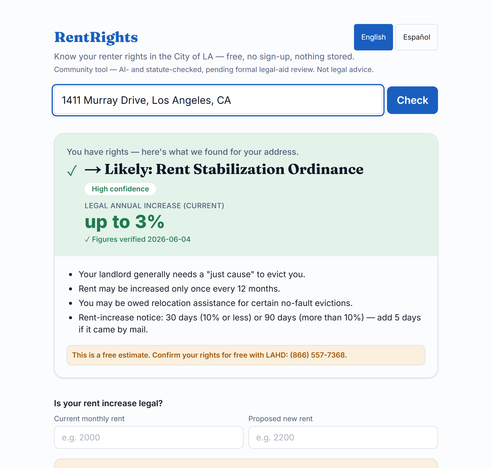
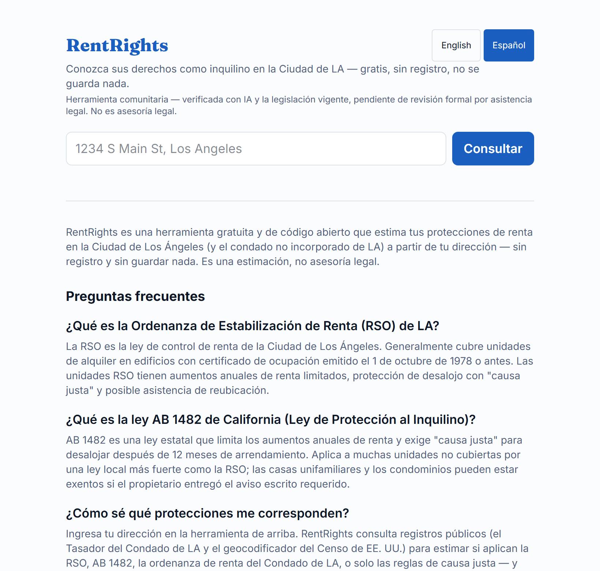
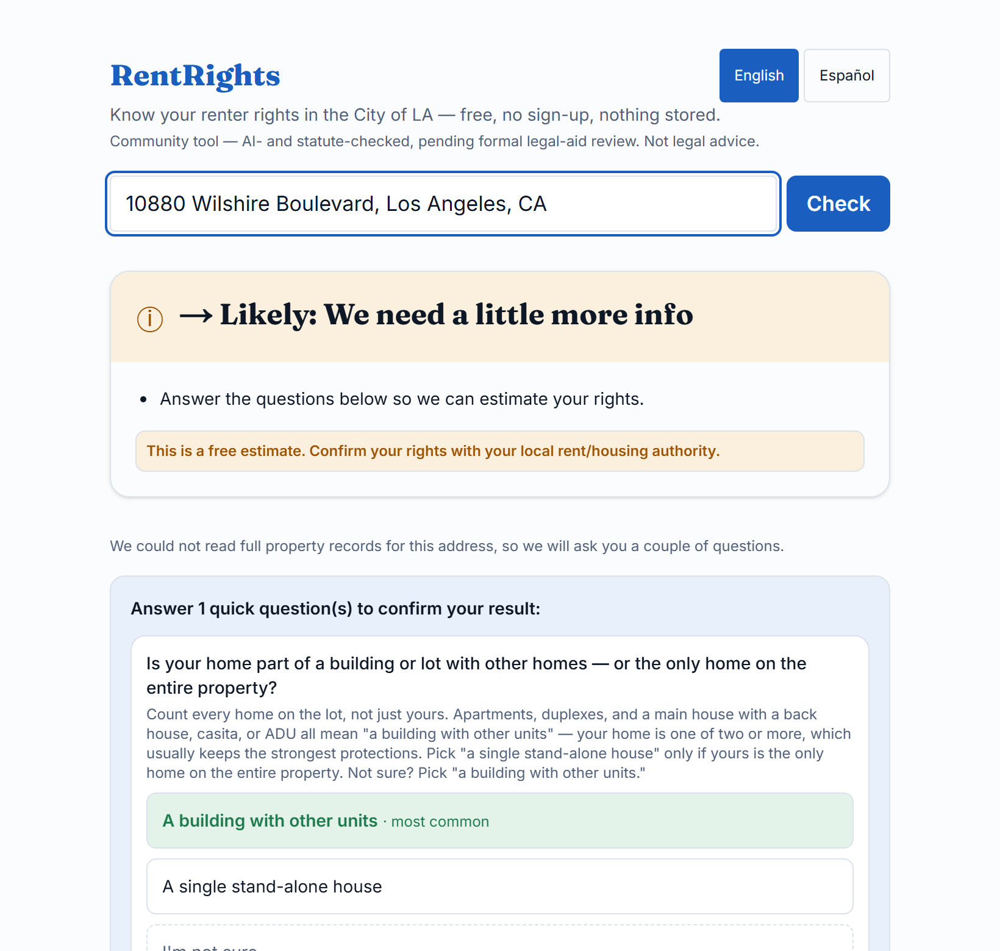
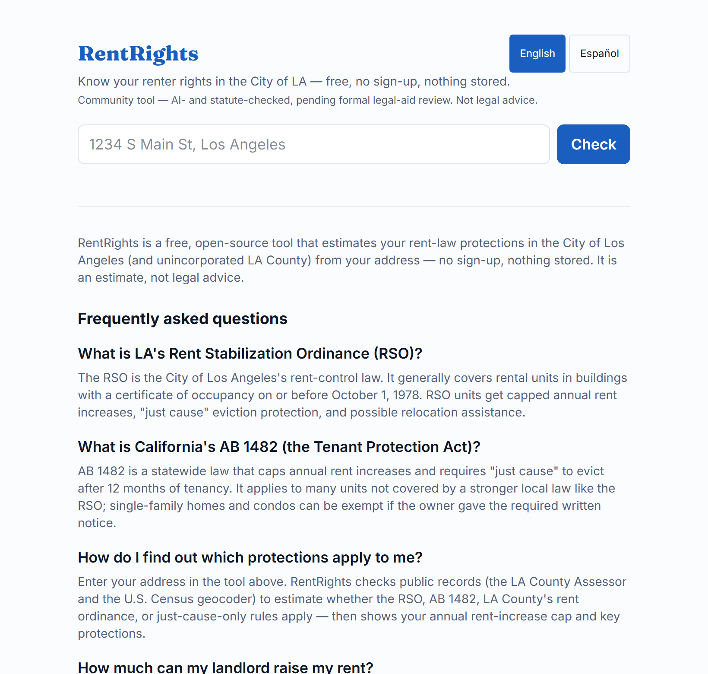

# RentRights — conozca sus derechos de inquilino en LA por su dirección

[English](README.md) · **Español**

**En vivo:** https://rentrights.writingdeveloper.blog · **Stack:** Next.js 16 (App Router) · React 19 · TypeScript · Tailwind v4 · Vitest/Playwright · Vercel

RentRights convierte una dirección de Los Ángeles en una **estimación honesta y
con fuentes** de qué ley de renta protege al inquilino — la **Ordenanza de
Estabilización de Renta (RSO)** de la Ciudad de LA, la **AB 1482** de California,
la **RSTPO** del Condado de LA, o solo "causa justa" — además del tope legal de
aumento vigente, un **verificador de legalidad** del aumento y las protecciones
clave del inquilino. Gratis, **bilingüe (inglés/español)**, sin registro y sin
guardar nada.

Existe porque la mayoría de los inquilinos de LA no sabe cuál de cuatro leyes de
renta superpuestas les aplica — y equivocarse cuesta dinero o un hogar. El
objetivo es ser *correcto y honesto sobre la incertidumbre* en vez de
equivocarse con seguridad.

> Es una estimación a partir de registros públicos, **no es asesoría legal** — la
> interfaz lo indica y dirige a cada inquilino a LAHD / DCBA / asistencia legal
> gratuita para confirmar.



## Pruébalo (guía rápida)

Abra el [sitio en vivo](https://rentrights.writingdeveloper.blog) e ingrese:

| Dirección | Qué demuestra |
|---|---|
| `1411 Murray Dr, Los Angeles` | **RSO** — edificio multifamiliar anterior a 1978, tope "hasta 3%", confianza alta, datos reales de la parcela (construido en 1931, 6 unidades) |
| `8800 Sunset Blvd, West Hollywood` | **AB 1482** — ciudad incorporada ≠ Ciudad de LA, dirigido a la base estatal |
| `2424 Fair Oaks Ave, Altadena` | **RSTPO/JCO del Condado** — área no incorporada detectada con datos del Censo |
| cualquier casa unifamiliar | **AB 1482 + una pregunta de confirmación** — la ruta de "necesitamos un poco más de información" |

Luego pruebe el **verificador de aumentos** (p. ej. renta actual 2000 → propuesta
2200 muestra "supera el tope legal, máx ≈ $2,060"), cambie a **/es** para español,
y abra "Vea los registros detrás de esta estimación" para ver los datos públicos
en los que se basa el resultado.

## Capturas

| Inicio | Preguntas de confirmación honestas | Inglés |
|---|---|---|
|  |  |  |

## Por qué es interesante (aspectos de ingeniería)

- **Un flujo real de registros públicos, no una simulación.** Una dirección se
  resuelve con la propia infraestructura del Condado de LA: geocodificador CAMS
  (punto en el techo) → parcelas del Tasador (punto-en-polígono → AIN) → padrón de
  avalúo (año, unidades, código de uso), con el geocodificador del Censo de EE. UU.
  para la jurisdicción. Los resultados se contrastan con el padrón oficial del
  condado — los números que ve son del condado, no codificados a mano.

- **Un problema de rendimiento resuelto con conocimiento del dominio.** La columna
  `AIN` del padrón *no está indexada* en el origen, así que filtrar por ella
  recorre ~2.4M filas (medido: 13–55s). Reconsultar por los **campos de domicilio
  indexados** (código postal + número) y elegir el AIN correcto en el cliente lo
  reduce a ~1s. Cada llamada externa lleva un timeout (`AbortController`) para que
  una API lenta del condado **degrade a preguntas de confirmación en vez de
  colgarse**.

- **Un motor de reglas de cuatro regímenes** (`lib/rules/engine.ts`) que deriva
  RSO / AB 1482 / Condado / causa justa a partir de los datos de la parcela y las
  respuestas del inquilino, con un **sesgo hacia la protección**: ante la duda, se
  inclina por la protección que el inquilino probablemente tiene en vez de afirmar
  "está exento".

- **Honesto sobre la incertidumbre por diseño.** Los registros incompletos
  producen un nivel de confianza + preguntas de confirmación puntuales (cada una
  con una opción segura "No estoy seguro/a" que asume lo más protector) — nunca
  datos inventados. Las cifras legales son **constantes con fechas de vigencia**
  que degradan automáticamente a "pendiente — confirme con LAHD" cuando un período
  vence, de modo que la herramienta nunca se equivoca con seguridad aunque quede
  sin mantenimiento.

- **Bilingüe y descubrible.** Catálogos completos EN/ES con una ruta `/es`
  rastreable (reescrita por proxy, clúster hreflang) para que el contenido en
  español se indexe; JSON-LD, sitemap/robots (que da la bienvenida a rastreadores
  de IA) y `llms.txt` para búsqueda GEO/IA.

- **Accesible y rápido.** WCAG AA verificado en esquemas **claro y oscuro** (cada
  par de colores ≥ 4.5:1), navegación por teclado, combobox ARIA, objetivos ≥44px;
  PageSpeed Insights **100/100/100/100** con Core Web Vitals en verde.

- **Higiene de producción.** Content-Security-Policy + HSTS + cabeceras de
  seguridad, límite de tasa en la app (defensa en profundidad tras una regla del
  Vercel Firewall), 404 + límites de error bilingües con marca, y una postura de
  privacidad que no guarda nada.

## Calidad

- **222 pruebas unitarias** (Vitest) + e2e con Playwright; CI ejecuta typecheck →
  lint → test → build en cada push y PR (`.github/workflows/ci.yml`), en verde en
  `master`.
- **Exactitud de datos verificada** contra el padrón en vivo del Tasador del
  Condado de LA (no solo "devuelve algo").
- **0 alertas de seguridad abiertas** (Dependabot), 0 vulnerabilidades en
  `npm audit`.

## Arquitectura

```
dirección ─▶ /api/lookup ─▶ lib/compute/lookup.ts
                              ├─ geocodificador Censo .. jurisdicción (ciudad / condado / fuera)
                              ├─ CAMS + Tasador ........ datos de parcela (año, unidades, uso)
                              └─ lib/rules/engine.ts ... régimen + confianza + razones + preguntas
                                    └─ lib/legal/constants.ts (cifras legales con fechas de vigencia)
```

El resultado se muestra con la respuesta primero: veredicto → (preguntas de
confirmación, si las hay) → verificador de aumento → qué hacer → ayuda ante
desalojo → directorio de organizaciones → evidencia → aviso legal. Las
especificaciones y planes están en `docs/superpowers/{specs,plans}/`.

## Desarrollo

```sh
npm install
npm run dev      # http://localhost:3000
npm test         # vitest (sin red)
npm run e2e      # playwright (consulta APIs en vivo del condado/Censo)
```

> ⚠️ No es el Next.js que quizá conoce — apunta a Next 16 (App Router, la
> convención `proxy` que reemplazó a `middleware`). Ver `AGENTS.md`.

## Despliegue

Producción corre en **Vercel** (Next.js nativo). Hacer push a `master` despliega
automáticamente; o `vercel --prod`.

- `NEXT_PUBLIC_SITE_URL` es de **tiempo de compilación** (incrustado por
  `next build`); el `.env.production` versionado fija el origen de producción, y
  una compilación que resolviera a `localhost` falla de inmediato
  (`lib/seo/site-url.ts`).
- Las variables de tiempo de ejecución (`UPSTREAM_TIMEOUT_MS`,
  `GOOGLE_/BING_SITE_VERIFICATION`) viven en el entorno del proyecto en Vercel.
  La analítica es Vercel Web Analytics sin cookies.
- Hay una alternativa de auto-hospedaje con Docker archivada en `deploy/docker/`.

## Mantenimiento de los datos legales

Las cifras legales viven en un único archivo con fechas, `lib/legal/constants.ts`,
cada una con `source` y `effectiveFrom`/`effectiveTo`. **Cadencia:** RSO %
(~1 jul), AB 1482 % (~1 ago), Condado % + reubicación (~1 jul). Edite la cifra →
`npm test` → suba `CONTENT_LAST_UPDATED` si cambió el texto del inicio/FAQ → push.
Hasta que se publique una nueva cifra, la interfaz muestra un aviso honesto
"pendiente — confirme con LAHD" en vez de un número desactualizado.

## Aviso legal

RentRights ofrece **información legal general, no asesoría legal**, y una
*estimación* a partir de registros públicos — no una consulta al registro oficial
de LAHD. Siempre se dirige a los inquilinos a LAHD, al DCBA del Condado de LA o a
asistencia legal gratuita para confirmar.

## Licencia

[MIT](LICENSE) — libre para usar, adaptar y construir sobre ella.
